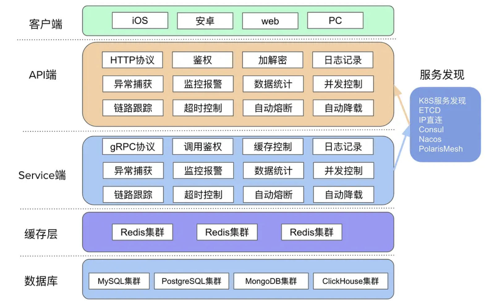
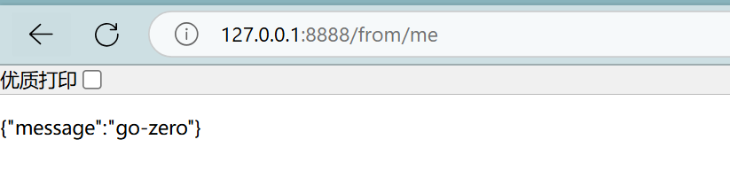
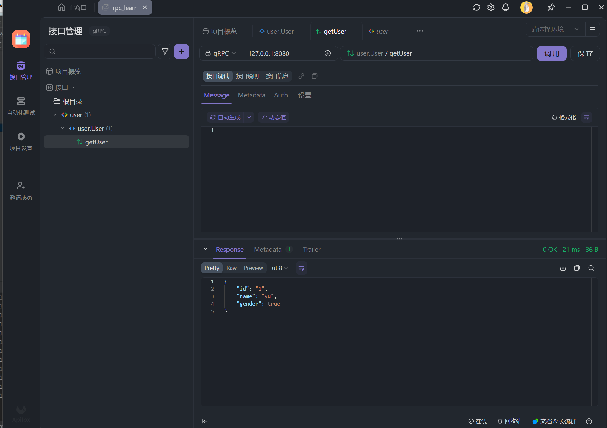

# go-zero 学习笔记

学习于:

[fengfengzhidao go-zero](https://docs.fengfengzhidao.com/#/docs/go-zero文档/1.go-zero介绍)

>go-zero 是一个集成了各种工程实践的 web 和 rpc 框架。通过弹性设计保障了大并发服务端的稳定性，经受了充分的实战检验。


## 微服务

微服务是一种**分布式架构设计理念**，核心是将传统**单体应用**拆分为**多个小型、独立的服务**，每个服务专注于单一业务功能（如用户管理、订单处理等），并通过**轻量级 API**通信协作。



### 核心特点：

1. **单一职责**：每个服务仅处理特定功能，职责明确。
2. **独立部署**：服务可独立开发、测试、部署，技术栈可灵活选择（如 Java、Python 混合）。
3. **松耦合**：服务间通过接口通信，底层实现解耦，某一服务故障不影响整体。
4. **去中心化**：每个服务有独立数据库，避免单体应用的数据库瓶颈。

### 常见场景：

- 高并发、高扩展性的互联网应用（如电商、社交平台）。
- 需快速迭代的业务，团队可并行开发不同服务。

### 对比单体应用：

- **单体应用**：像 “大超市”，所有功能集成在一个程序里，牵一发而动全身。
- **微服务**：像 “商业综合体”，各店铺（服务）独立运营，可灵活调整。

###  常用工具：

- 服务治理：go-zero Go-Kit
- 容器化：Docker、Kubernetes
- 通信：RESTful API、gRPC

**拆大为小，独立自治，灵活组合**


## 环境安装

### goctl

```bash
# 安装 gozero 工具
go install github.com/zeromicro/go-zero/tools/goctl@latest
#  查看 go control
goctl
A cli tool to generate api, zrpc, model code

GitHub: https://github.com/zeromicro/go-zero
Site:   https://go-zero.dev

Usage:
  goctl [command]

Available Commands:
  api               Generate api related files
  bug               Report a bug
  completion        Generate the autocompletion script for the specified shell
  config            
  docker            Generate Dockerfile
  env               Check or edit goctl environment
  gateway           gateway is a tool to generate gateway code
  help              Help about any command
  kube              Generate kubernetes files
  migrate           Migrate from tal-tech to zeromicro
  model             Generate model code
  quickstart        quickly start a project
  rpc               Generate rpc code
  template          Template operation
  upgrade           Upgrade goctl to latest version

Flags:
  -h, --help      help for goctl
  -v, --version   version for goctl


Use "goctl [command] --help" for more information about a command.
```

### protoc

```bash
goctl env check --install --verbose --force

go get -u github.com/zeromicro/go-zero@latest
```

### goland安装goctl插件

open Goland > settings > plugin > search:goctl > install


### 快速创建一个api服务

```bash
mkdir user
cd  user
goctl api new api
```

然后修改一下`user/api/internal/logic/apilogic.go`文件

```go
func (l *ApiLogic) Api(req *types.Request) (resp *types.Response, err error) {
  return &types.Response{Message: "gozero"}, nil
}
```

然后在user的api目录运行

```bash
go run api.go
#  运行不成功 缺少依赖输入  go mod  tidy
Starting server at 0.0.0.0:8888...
```

访问 127.0.0.1:8888/from/me 能看到数据就说明环境安装好了



快速创建一个rpc服务

```bash
cd .. # 打开user目录
goctl rpc new user_rpc
```


## etcd

**etcd** 是一个**分布式键值存储系统**，用于**服务发现、配置管理和分布式协调** 

数据可靠性强于redis


### **核心功能**

1. **键值存储**
   支持简单的 key-value 存储，值可存储配置、元数据等，支持目录结构和递归操作。
2. **服务注册与发现**
   微服务可将自身地址注册到 etcd 中，其他服务通过查询 etcd 发现可用实例。
3. **分布式锁与租约**
   基于租约（Lease）实现分布式锁，用于协调多个节点的操作（如选主、任务调度）。
4. **Watch 机制**
   监听 key 的变化（增、删、改），实时触发更新（如配置热加载、服务上下线通知）。

### **主要特点**

1. **高可用性**
   基于 Raft 算法实现多节点集群，自动选举 leader，支持数据复制和故障恢复。
2. **强一致性**
   Raft 保证数据在多数节点确认后才提交，避免脑裂等问题。
3. **安全可靠**
   支持 HTTPS 加密通信、身份认证（RBAC）和数据加密存储。
4. **轻量高效**
   用 Go 语言开发，部署简单（单二进制文件），支持水平扩展。

### **典型应用场景**

- **Kubernetes**：作为后端存储，保存集群所有资源的状态。
- **微服务治理**：服务注册中心（如服务网格 Istio）、配置中心。
- **分布式系统**：分布式锁、选主、任务调度协调（如 Apache Dubbo 的注册中心可选 etcd）。


### 安装

docker

```bash
docker run --name etcd -d -p 2379:2379 -p 2380:2380 -e ALLOW_NONE_AUTHENTICATION=yes bitnami/etcd:latest etcd
```

```bash
docker exec -it etcd /bin/bash
```


### 语法

```bash
// 设置或更新值
etcdctl put go.gopher gopher
-OK
etcdctl put go.go hello
-OK

etcdctl get go.gopher
-go.gopher
-gopher


etcdctl get go.gopher --print-value-only
-gopher

etcdctl get --prefix go          
-go.gopher
-gopher
-go.go
-hello

 etcdctl del go.gopher
-1
#  监听
 etcdctl watch name
```


## api rpc

在微服务架构中，`api` 和 `rpc` 目录的区别主要体现在**职责定位、通信协议、代码结构**上。以下是结合常见项目结构（如 Go 语言的 `go-zero` 框架）的详细分析：

###  **一、核心区别**

| **维度** | **`api` 目录（如 `video/api`）**                | **`rpc` 目录（如 `user/rpc`）**                      |
| -------- | ----------------------------------------------- | ---------------------------------------------------- |
| **定位** | 对外暴露的**接口层**（面向终端用户 / 外部系统） | 对内的**服务间通信层**（面向内部微服务）             |
| **协议** | 通常使用 **HTTP/HTTPS**（如 RESTful）           | 通常使用 **RPC 协议**（如 gRPC、Thrift、Kitex）      |
| **职责** | 处理请求路由、参数校验、权限认证、响应格式化    | 专注业务逻辑，提供原子化服务（如用户查询、订单创建） |
| **性能** | 基于文本协议，开销大，适合对外场景              | 基于二进制协议，高效低延迟，适合内部高频调用         |

### **二、目录结构对比**

以你的项目为例：

**1. `rpc` 目录（如 `user/rpc`）**

典型结构（以 `go-zero` 框架为例）：

```plaintext
user/rpc
├── etc         # 配置文件（如 etcd、数据库配置）
├── internal    # 内部代码（不对外暴露）
│   ├── config  # 配置结构体
│   ├── logic   # 核心业务逻辑
│   ├── server  # RPC 服务端实现
│   └── svc     # 服务上下文（依赖注入）
├── types       # 定义 RPC 接口的请求/响应结构体（.proto 文件生成）
└── userclient  # 自动生成的 RPC 客户端代码
```

**特点**：

- 通过 **`.proto` 文件**定义接口（如 `user.proto`），使用工具（如 `protoc`）生成服务端和客户端代码。
- 依赖 **注册中心**（如 etcd）实现服务发现。


**2. `api` 目录（如 `video/api`）**

典型结构（以 `go-zero` 框架为例）：

```plaintext
video/api
├── etc         # 配置文件（如端口、中间件配置）
├── internal    # 内部代码
│   ├── config  # 配置结构体
│   ├── handler # HTTP 请求处理器（路由绑定）
│   ├── logic   # 业务逻辑（可能调用 RPC 服务）
│   ├── svc     # 服务上下文（依赖注入）
│   └── types   # 定义 HTTP 请求/响应结构体
└── video.api   # 接口定义文件（go-zero 专属，描述路由、参数、响应）
```

**特点**：

- 通过 **`.api` 文件**定义 HTTP 接口（如 `video.api`），使用 `goctl` 生成代码。
- 通常作为**网关层**，负责**鉴权、限流、参数校验**等通用逻辑。


### **三、实际应用场景**

1. **`rpc` 服务**（以 `user/rpc` 为例）：

   - 提供**原子化服务**，如 `GetUserInfo`、`UpdateUserProfile`。
   - 被其他微服务（如 `video/api`）通过 RPC 客户端调用。
   - 不直接对外暴露，内网通信。

2. **`api` 服务**（以 `video/api` 为例）：

   - 接收**终端用户请求**（如浏览器、App），例如 `/video/list`。
   - 在 `logic` 中调用多个 RPC 服务（如 `user/rpc` 获取用户信息，`video/rpc` 获取视频列表）。
   - 处理**跨服务聚合**，返回最终响应。

   

### **四、总结**

| **场景**         | **使用 `api`**        | **使用 `rpc`**              |
| ---------------- | --------------------- | --------------------------- |
| 对外提供接口     | ✅（HTTP/HTTPS）       | ❌                           |
| 内部服务间通信   | ❌（效率低）           | ✅（高性能 RPC）             |
| 复杂业务逻辑聚合 | ✅（网关层整合）       | ❌（原子化服务）             |
| 协议灵活性       | ✅（文本协议，易调试） | ❌（二进制协议，需代码生成） |


### **五、扩展：go-zero 框架的最佳实践**

1. **API 服务**：

   - 使用 `goctl api` 生成代码，专注 HTTP 路由和网关逻辑。

   - 示例：

     go


     ```go
     // video.api
     type (
         VideoListRequest {
             Page int `form:"page" validate:"gte=1"`
         }
         VideoListResponse {
             Total int64    `json:"total"`
             List  []Video  `json:"list"`
         }
     )
     
     service video-api {
         @server(
             handler: VideoListHandler
         )
         get /video/list VideoListRequest => VideoListResponse
     }
     ```

2. **RPC 服务**：

   - 使用 `goctl rpc` 生成代码，专注业务逻辑。

   - 示例：

     protobuf

     ```protobuf
     // user.proto
     service UserRpc {
         rpc GetUserInfo (GetUserInfoRequest) returns (GetUserInfoResponse) {}
     }
     
     message GetUserInfoRequest {
         int64 userId = 1;
     }
     ```

     

通过这种分层设计，可实现**外轻内重**：API 层轻量灵活，RPC 层高效稳定，符合微服务架构的设计原则。


## API

### API文件结构

GoZero的API文件由三部分组成：

1. **类型定义**：定义请求/响应数据结构
2. **服务定义**：定义HTTP路由和处理器映射
3. **元信息**（可选）：如JWT配置等

------

### 类型定义规范

#### 1. 基本语法

```go
type 结构体名称 {
    字段名 类型 `标签`
    // 例：
    UserName string `json:"userName"`
}
```

#### 2. 关键要点

- **字段首字母必须大写**：生成的Go结构体需要导出字段
- **JSON标签推荐小写**：保持前后端命名规范一致
- **嵌套结构**：可以直接引用其他定义的结构体

#### 3. 示例

```go
// user.api

type LoginRequest {
    UserName string `json:"userName"`
    Password string `json:"password"`
}

type LoginResponse {
    Code int    `json:"code"`
    Data string `json:"data"`
    Msg  string `json:"msg"`
}

type UserInfo {
    Id       uint   `json:"id"`
    UserName string `json:"userName"`
    Addr     string `json:"addr"`
}

type UserInfoResponse {
    Code int      `json:"code"`
    Data UserInfo `json:"data"`
    Msg  string   `json:"msg"`
}

service user {
    @handler login
    post /api/users/login (LoginRequest) returns (LoginResponse)
    
    @handler userInfo
    get /api/users/info returns (UserInfoResponse)
}
```

------

### 服务定义规范

#### 1. 基本语法

```go
service 服务名称 {
    // Handler语法
    @handler 处理器名称
    HTTP方法 路由路径 [（请求体）] returns (响应体)
}
```

#### 2. 路由示例解析

```go
service user {
    // 登录接口
    @handler login
    post /api/users/login (LoginRequest) returns (LoginResponse)
    
    // 用户信息接口 
    @handler userInfo
    get /api/users/info returns (UserInfoResponse)
}
```

#### 3. 关键要点

1. **HTTP方法**：支持get/post/put/delete等

2. **路径参数**：

   ```go
   get /user/:id returns (Response)
   ```

3. **请求体**：

   - POST/PUT等需要body的方法：`(RequestStruct)`
   - GET/DELETE等无body方法：不需要括号内容

4. **返回值**：必须用returns明确声明

5. **处理器名称**：

   - 需唯一
   - 对应生成代码中的处理方法名

------

### 响应封装

一般前端接收一下类型

```json
{
    "code": 0,
    "data": "xxx.xxx.xxx",
    "msg": "成功"
}
```

为了避免每个api嵌套一下,我们写一个common包,用来统一存储

在handler层里

```go
func loginHandler(svcCtx *svc.ServiceContext) http.HandlerFunc {
	return func(w http.ResponseWriter, r *http.Request) {
		var req types.LoginRequest
		if err := httpx.Parse(r, &req); err != nil {
			httpx.ErrorCtx(r.Context(), w, err)
			return
		}

		l := logic.NewLoginLogic(r.Context(), svcCtx)
		resp, err := l.Login(&req)
		if err != nil {
			httpx.ErrorCtx(r.Context(), w, err)
		} else {
			httpx.OkJsonCtx(r.Context(), w, resp)
		}
	}
}

```

使用`	httpx.ErrorCtx(r.Context(), w, err)`返回响应

我们修改返回json

####  COMMON 层封装

```go
package response

import (
	"github.com/zeromicro/go-zero/rest/httpx"
	"net/http"
)

type Body struct {
	Code int    `json:"code"`
	Data any    `json:"data"`
	Msg  string `json:"msg"`
}

func Response(r *http.Request, w http.ResponseWriter, resp any, err error) {
	if err == nil {
		httpx.WriteJson(w, http.StatusOK, &Body{
			Code: 0,
			Msg:  "成功",
			Data: resp,
		})
		return
	}
	errCode := 10086
	// 可以根据错误码，返回具体错误信息
	errMsg := "服务器错误"

	httpx.WriteJson(w, http.StatusBadRequest, &Body{
		Code: errCode,
		Msg:  errMsg,
		Data: nil,
	})
}
```


```go
package handler

import (
	"gozero_learn/api_learn/user/common/response"
	"net/http"

	"github.com/zeromicro/go-zero/rest/httpx"
	"gozero_learn/api_learn/user/apiv1/internal/logic"
	"gozero_learn/api_learn/user/apiv1/internal/svc"
	"gozero_learn/api_learn/user/apiv1/internal/types"
)

func loginHandler(svcCtx *svc.ServiceContext) http.HandlerFunc {
	return func(w http.ResponseWriter, r *http.Request) {
		var req types.LoginRequest
		if err := httpx.Parse(r, &req); err != nil {
			httpx.ErrorCtx(r.Context(), w, err)
			return
		}

		l := logic.NewLoginLogic(r.Context(), svcCtx)
		resp, err := l.Login(&req)
		response.Response(r, w, resp, err)
	}
}

```

但每次在handler改各个请求的结构很麻烦,我们统一注册中间件

#### GOTCL template

*但每个项目这样的话都要修改一下,感觉有点麻烦,而且很奇怪 不同的项目会不相互影响吗*

*感觉还是不要这写了,自己在每个api handler复制一下 resp算了*

```bash
# 生成tpl
goctl template init
```

使用everything搜到修改

```go
package handler

import (
    "net/http"
    "github.com/zeromicro/go-zero/rest/httpx"
    {{.ImportPackages}}
    "gozero_learn/api_learn/user/common/response"
)

func {{.HandlerName}}(svcCtx *svc.ServiceContext) http.HandlerFunc {
    return func(w http.ResponseWriter, r *http.Request) {
        {{if .HasRequest}}var req types.{{.RequestType}}
        if err := httpx.Parse(r, &req); err != nil {
            httpx.Error(w, err)
            return
        }{{end}}

        l := logic.New{{.LogicType}}(r.Context(), svcCtx)
        {{if .HasResp}}resp, {{end}}err := l.{{.Call}}({{if .HasRequest}}&req{{end}})
        {{if .HasResp}}response.Response(r, w, resp, err){{else}}response.Response(r, w, nil, err){{end}}

    }
}

```


###  特殊语法扩展

#### 1. 文件上传

```go
@handler upload
post /upload returns (UploadResponse) {
    // 文件上传格式声明
    type form struct {
        file []byte `form:"file"`
    }
}
```

#### 2. 中间件配置


```go
@server(
    middleware: AuthMiddleware // 声明中间件
)
service user {
    //...
}
```

#### 3. JWT配置

*Authorization: "Bearer token"*

```go
@server (
	prefix: /apiv1/users
)
service user {
	@handler login
	post /login (LoginRequest) returns (string)
}

@server (
	prefix: /apiv1/users
	jwt:    Auth
)
service user {
	@handler userInfo
	get /info returns (UserInfoResponse)
}


```

yaml配置 jwt信息

```yaml
Name: user
Host: 0.0.0.0
Port: 8888

Auth:
  AccessSecret: "123123123123"
  AccessExpire: 3600
```


logic层:

```go
// 登录生成token
func loginHandler(svcCtx *svc.ServiceContext) http.HandlerFunc {
	return func(w http.ResponseWriter, r *http.Request) {
		var req types.LoginRequest
		if err := httpx.Parse(r, &req); err != nil {
			httpx.ErrorCtx(r.Context(), w, err)
			return
		}

		l := logic.NewLoginLogic(r.Context(), svcCtx)
		resp, err := l.Login(&req)
		response.Response(r, w, resp, err)
	}
}

```

```go
//  需要token服务解析token
func (l *UserInfoLogic) UserInfo() (resp *types.UserInfoResponse, err error) {
	user_id := l.ctx.Value("user_id").(json.Number)
	username := l.ctx.Value("username").(string)
	uid, _ := user_id.Int64()
	return &types.UserInfoResponse{
		Id:       uint(uid),
		UserName: username,
		Addr:     "",
	}, nil
}

```

jwt相关方法自己编写

```go
	package jwt

import (
	"errors"
	"github.com/golang-jwt/jwt/v4"
	"time"
)

// JwtPayLoad jwt中payload数据
type JwtPayLoad struct {
	UserID   uint   `json:"user_id"`
	Username string `json:"username"` // 用户名
	Role     int    `json:"role"`     // 权限  1 普通用户  2 管理员
}

type CustomClaims struct {
	JwtPayLoad
	jwt.RegisteredClaims
}

// GenToken 创建 Token
func GenToken(user JwtPayLoad, accessSecret string, expires int64) (string, error) {
	claim := CustomClaims{
		JwtPayLoad: user,
		RegisteredClaims: jwt.RegisteredClaims{
			ExpiresAt: jwt.NewNumericDate(time.Now().Add(time.Hour * time.Duration(expires))),
		},
	}

	token := jwt.NewWithClaims(jwt.SigningMethodHS256, claim)
	return token.SignedString([]byte(accessSecret))
}

// ParseToken 解析 token
func ParseToken(tokenStr string, accessSecret string, expires int64) (*CustomClaims, error) {

	token, err := jwt.ParseWithClaims(tokenStr, &CustomClaims{}, func(token *jwt.Token) (interface{}, error) {
		return []byte(accessSecret), nil
	})
	if err != nil {
		return nil, err
	}
	if claims, ok := token.Claims.(*CustomClaims); ok && token.Valid {
		return claims, nil
	}
	return nil, errors.New("invalid token")
}

```

没有通过jwt的响应是401可以自己修改

```go

func main() {
	flag.Parse()

	var c config.Config
	conf.MustLoad(*configFile, &c)

	server := rest.MustNewServer(c.RestConf, rest.WithUnauthorizedCallback(JwtUnauthorizedResult))
	defer server.Stop()

	ctx := svc.NewServiceContext(c)
	handler.RegisterHandlers(server, ctx)

	fmt.Printf("Starting server at %s:%d...\n", c.Host, c.Port)
	server.Start()
}
func JwtUnauthorizedResult(w http.ResponseWriter, r *http.Request, err error) {
	fmt.Println(err) // 具体的错误，没带token，token过期？伪造token？
	httpx.WriteJson(w, http.StatusOK, response.Body{10087, "鉴权失败", "failed"})
}

```


#### 4. API 前缀

```go
// 封装响应
type LoginRequest {
	UserName string `json:"userName"`
	Password string `json:"password"`
}

type UserInfoResponse {
	Id       uint   `json:"id"`
	UserName string `json:"userName"`
	Addr     string `json:"addr"`
}

@server (
	prefix: /apiv1/users
)
service user {
	@handler login
	post /login (LoginRequest) returns (string)

	@handler userInfo
	get /info returns (UserInfoResponse)
}

// 转化
// goctl api go -api user.api -dir .

```


------

###  操作database：

#### sqlx 原生sql

```bash
├───api
│   ├───etc
│   └───internal
│       ├───config
│       ├───handler
│       ├───logic
│       ├───svc
│       └───types
└───model
```

##### model中写sql建表语句

```sql
#  user.sql

CREATE database gozero_learn;
use gozero_learn;
CREATE TABLE user
(
    id        bigint AUTO_INCREMENT,
    username  varchar(36) NOT NULL,
    password  varchar(64) default '',
    UNIQUE name_index (username),
    PRIMARY KEY (id)
) ENGINE = InnoDB COLLATE utf8mb4_general_ci;

# goctl model mysql ddl --src user.sql --dir .
```

bash输入`goctl model mysql ddl --src user.sql --dir .`生成数据库相关的代码

##### api层配置

config

```go
// model_learn/user/api/internal/config/config.go

package config

import "github.com/zeromicro/go-zero/rest"
type Config struct {
	rest.RestConf
	Mysql struct {
		DataSource string
	}
}

```

yaml

```yaml
Name: user
Host: 0.0.0.0
Port: 8888
Mysql:
  DataSource: root:123456@tcp(127.0.0.1:3307)/gozero_learn?charset=utf8mb4&parseTime=True&loc=Local
```

依赖注入

```go
package svc

import (
	"github.com/zeromicro/go-zero/core/stores/sqlx"
	"gozero_learn/model_learn/user/api/internal/config"
	"gozero_learn/model_learn/user/model"
)

type ServiceContext struct {
	Config     config.Config
	UsersModel model.UserModel
}

func NewServiceContext(c config.Config) *ServiceContext {
	mysqlConn := sqlx.NewMysql(c.Mysql.DataSource)
	return &ServiceContext{
		Config:     c,
		UsersModel: model.NewUserModel(mysqlConn),
	}

}

```

调用方法 logic直接写了(可以再解耦)

```sql
package logic

import (
	"context"
	"fmt"
	"gozero_learn/model_learn/user/model"

	"gozero_learn/model_learn/user/api/internal/svc"
	"gozero_learn/model_learn/user/api/internal/types"

	"github.com/zeromicro/go-zero/core/logx"
)

type LoginLogic struct {
	logx.Logger
	ctx    context.Context
	svcCtx *svc.ServiceContext
}

func NewLoginLogic(ctx context.Context, svcCtx *svc.ServiceContext) *LoginLogic {
	return &LoginLogic{
		Logger: logx.WithContext(ctx),
		ctx:    ctx,
		svcCtx: svcCtx,
	}
}
func (l *LoginLogic) Login(req *types.LoginRequest) (resp string, err error) {
	// 增
	l.svcCtx.UsersModel.Insert(context.Background(), &model.User{
		Username: "测试插入name2",
		Password: "123456",
	})
	fmt.Println("============================")
	// 查
	user, err := l.svcCtx.UsersModel.FindOne(context.Background(), 1)
	fmt.Println(user, err)
	fmt.Println("============================")

	// 查
	user, err = l.svcCtx.UsersModel.FindOneByUsername(context.Background(), "测试插入name")
	fmt.Println(user, err)
	fmt.Println("============================")

	// 改
	l.svcCtx.UsersModel.Update(context.Background(), &model.User{
		Username: "测试插入hhhha",
		Password: "1234567",
		Id:       1,
	})
	user, err = l.svcCtx.UsersModel.FindOne(context.Background(), 1)
	fmt.Println(user, err)
	fmt.Println("============================")

	user, err = l.svcCtx.UsersModel.FindOne(context.Background(), 1)
	fmt.Println(user, err)
	// 删
	l.svcCtx.UsersModel.Delete(context.Background(), 1)
	user, err = l.svcCtx.UsersModel.FindOne(context.Background(), 1)
	l.svcCtx.UsersModel.Delete(context.Background(), 2)
	user, err = l.svcCtx.UsersModel.FindOne(context.Background(), 2)
	fmt.Println(user, err)
	return
}

```

##### sql封装

model gen的sql usermodel_gen.go中

```go
type (
	userModel interface {
		Insert(ctx context.Context, data *User) (sql.Result, error)
		FindOne(ctx context.Context, id int64) (*User, error)
		FindOneByUsername(ctx context.Context, username string) (*User, error)
		Update(ctx context.Context, data *User) error
		Delete(ctx context.Context, id int64) error
	}

	defaultUserModel struct {
		conn  sqlx.SqlConn
		table string
	}

	User struct {
		Id       int64  `db:"id"`
		Username string `db:"username"`
		Password string `db:"password"`
	}
)

```

userModel接口需要实现6个类,可自己添加函数签名后

在defaultUserModel绑定方法中添加新的方法

```go
func (m *defaultUserModel) Delete(ctx context.Context, id int64) error {
	query := fmt.Sprintf("delete from %s where `id` = ?", m.table)
	_, err := m.conn.ExecCtx(ctx, query, id)
	return err
}

```

defaultUserModel有一个数据库连接对象conn,和table 名 也可以自己自定义


#### gorm 

#####  编写model层

```go
package model

type UserModel struct {
	Username string `gorm:"size:32" json:"username"`
	Password string `gorm:"size:64" json:"password"`
}

func (UserModel) TableName() string {
	return "user"
}

```

##### yaml添加 config配置

```go
type Config struct {
	rest.RestConf
	Mysql struct {
		DataSource string
	}
}

```


##### svc依赖注入

```go
type ServiceContext struct {
	Config config.Config
	DB     *gorm.DB
}

func NewServiceContext(c config.Config) *ServiceContext {
	return &ServiceContext{
		Config: c,
		DB:     common.InitGorm(c.Mysql.DataSource),
	}

}

```

gorm连接文件

```go
package common

import (
	"fmt"
	"gorm.io/driver/mysql"
	"gorm.io/gorm"
)

// InitGorm gorm初始化
func InitGorm(MysqlDataSource string) *gorm.DB {
	db, err := gorm.Open(mysql.Open(MysqlDataSource), &gorm.Config{})
	if err != nil {
		panic("连接mysql数据库失败, error=" + err.Error())
	} else {
		fmt.Println("连接mysql数据库成功")
	}
	return db
}

```

##### login层调用

```go
func (l *LoginLogic) Login(req *types.LoginRequest) (resp string, err error) {
    user := model.UserModel{
       Username: req.UserName,
       Password: req.Password,
    }
    err = l.svcCtx.DB.Create(&user).Error
    if err != nil {
       return "", errors.New("登录失败")
    }
    return user.Username, nil
}
```

------

### 常见错误排查

1. **字段不可见**：
   - 现象：生成的JSON字段为空
   - 检查：结构体字段首字母是否大写
2. **404路由不匹配**：
   - 检查：路径参数是否正确定义（如/:id）
   - 检查：HTTP方法是否匹配（POST/GET）
3. **参数绑定失败**：
   - GET请求：参数应通过query传递，需定义在结构体中
   - POST请求：确保Content-Type为application/json

------

## RPC

服务与服务之间的通信,用于服务间的通信,在内网

### proto编写

#### 1. 基础声明


```protobuf
syntax = "proto3";  // 指定使用proto3语法
package user;       // proto包名，用于避免命名冲突
option go_package = "./user"; // 生成的Go代码包路径
```

- **`syntax`**：必须声明，proto3是当前主流版本
- **`package`**：逻辑包名，不同proto文件间的隔离标识
- **`go_package`**：生成的Go代码的导入路径，建议保持与项目模块路径一致

------

#### 2. 消息类型（Message）


```protobuf
// 用户信息请求
message UserInfoRequest {
  uint32 user_id = 1;  // 字段编号必须唯一
}

// 用户信息响应
message UserInfoResponse {
  uint32 user_id = 1;
  string username = 2;
}

// 用户创建请求
message UserCreateRequest {
  string username = 1;
  string password = 2;  // 实际场景建议加密传输
}

// 用户创建响应（空表示操作成功）
message UserCreateResponse {}
```

- **字段编号规则**：
  - 必须从1开始，不能重复
  - 1-15占用1字节，适合高频字段
  - 保留字段：删除或注释的字段编号不要重复使用
- **字段类型**：
  - 常用类型：`string`, `int32`, `uint32`, `bool`, `bytes`
  - 推荐使用明确长度的类型如`int64`代替`int`

------

#### 3. 服务定义（Service）

```protobuf
service user {
  rpc UserInfo(UserInfoRequest) returns (UserInfoResponse);
  rpc UserCreate(UserCreateRequest) returns (UserCreateResponse);
}
```

- 定义了两个RPC端点：
  - **UserInfo**：查询用户信息
  - **UserCreate**：创建新用户
- 方法遵循 **请求-响应** 模式

#### 4. 生成代码

```bash
goctl rpc protoc user.proto \
  --go_out=./types \
  --go-grpc_out=./types \
  --zrpc_out=.
```

1. **参数说明**：

   - `--go_out`：生成普通gRPC代码（消息结构）
   - `--go-grpc_out`：生成gRPC服务接口代码
   - `--zrpc_out`：生成go-zero增强代码（服务启动、配置等）

2. **生成文件结构**：

   ```bash
   ├───etc            # 配置文件目录
   ├───internal       # 内部实现代码
   │   ├───config     # 配置结构定义
   │   ├───logic      # 业务逻辑实现
   │   ├───server     # 服务启动配置
   │   └───svc        # 依赖管理
   ├───types          # Protobuf生成代码
   │   └───user       # 领域相关类型
   └───userclient     # 客户端SDK
   ```

#### 5. 常见问题

字段兼容性

- **禁止修改**已使用字段的编号和类型

- 新增字段应使用**新编号**

- 废弃字段使用`reserved`标记：

  

  ```protobuf
  message Foo {
    reserved 2, 5 to 8;
    reserved "phone";
  }
  ```

 命名规范

- 消息名使用**大驼峰**：`UserInfoRequest`
- 字段名使用**小写+下划线**：`user_id`
- 服务名和方法名使用**大驼峰**

性能优化

- 高频请求字段尽量使用1-15编号
- 避免过度嵌套消息结构
- 大数据传输使用`bytes`代替`string`

### 服务分组

>默认情况下，一个proto文件里面只能有一个service
>
>有多个的话，转换会报错
>
>如果一个rpc服务，有很多方法，转换之后的目录就很不直观了
>
>我们可以在转换的时候，使用-m参数指定服务分组

```protobuf
syntax = "proto3";

package user;
option go_package = "./user";

message UserInfoRequest {
  uint32 user_id = 1;
}

message UserInfoResponse {
  uint32 user_id = 1;
  string username = 2;
}


message UserCreateRequest {
  string username = 1;
  string password = 2;
}

message UserCreateResponse {

}

service UserCreate {
  rpc UserCreate(UserCreateRequest) returns(UserCreateResponse);
}


service UserInfo {
  rpc UserInfo(UserInfoRequest) returns(UserInfoResponse);
}


// goctl rpc protoc user.proto --go_out=./types --go-grpc_out=./types --zrpc_out=. -m

```

命令 `goctl rpc protoc user.proto --go_out=./types --go-grpc_out=./types --zrpc_out=. -m` 的详细讲解，包括参数含义、生成的文件结构及作用：

1. `goctl rpc protoc`

- **作用**：调用 go-zero 的代码生成工具，针对 proto 文件生成 RPC 服务相关代码。
- **核心功能**：
  - 生成 Protobuf 结构定义（`.pb.go`）
  - 生成 gRPC 服务接口（`_grpc.pb.go`）
  - 生成 go-zero 增强代码（服务配置、启动逻辑、依赖管理等）

------

2. `user.proto`

- **作用**：输入的 Protobuf 文件，定义了 RPC 服务和消息结构。
- **要求**：需符合 proto3 语法规范，包含完整的服务和方法定义。

------

3. 输出参数

| 参数                    | 作用说明                                                | 生成内容示例                   |
| :---------------------- | :------------------------------------------------------ | :----------------------------- |
| `--go_out=./types`      | 生成 Protobuf 结构体代码（消息类型）                    | `user.pb.go`                   |
| `--go-grpc_out=./types` | 生成 gRPC 服务接口代码（客户端/服务端存根）             | `user_grpc.pb.go`              |
| `--zrpc_out=.`          | 生成 go-zero 框架的增强代码（服务启动、配置、逻辑层等） | `internal/`, `etc/`, `user.go` |
| `-m`                    | 生成 Model 层代码（数据库操作层），需配合数据库配置使用 | `model/usermodel.go`           |


### 结合gorm

```protobuf
syntax = "proto3";

package user;

option go_package = "./user";


message UserInfoRequest {
  uint32 user_id = 1;
}
message UserInfoResponse {
  uint32 user_id = 1;
  string username = 2;
}


message UserCreateRequest {
  string username = 1;
  string password = 2;
}
message UserCreateResponse {
  uint32 user_id = 1;
  string err = 2;
}


service user{
  rpc UserInfo(UserInfoRequest)returns(UserInfoResponse);
  rpc UserCreate(UserCreateRequest)returns(UserCreateResponse);
}


// goctl rpc protoc user.proto --go_out=./types --go-grpc_out=./types --zrpc_out=.

```

model

```go
package models

import "gorm.io/gorm"

type UserModel struct {
	gorm.Model
	Username string `gorm:"size:32" json:"username"`
	Password string `gorm:"size:64" json:"password"`
}

func (UserModel) TableName() string {
	return "users"
}

```

yaml

```yaml
Name: user.rpc
ListenOn: 0.0.0.0:8080
Etcd:
  Hosts:
    - 127.0.0.1:2379
  Key: user.rpc
Mysql:
  DataSource: root:123456@tcp(127.0.0.1:3307)/gozero_learn?charset=utf8mb4&parseTime=True&loc=
```

config

```go
package config

import "github.com/zeromicro/go-zero/zrpc"

type Config struct {
	zrpc.RpcServerConf
	Mysql struct {
		DataSource string
	}
}

```

svc 依赖注入

```go
package svc

import (
	"fmt"
	"gorm.io/driver/mysql"
	"gorm.io/gorm"
	models "gozero_learn/rpc_learn/user_gorm/model"
	"gozero_learn/rpc_learn/user_gorm/rpc/internal/config"
)

type ServiceContext struct {
	Config config.Config
	DB     *gorm.DB
}

func NewServiceContext(c config.Config) *ServiceContext {
	db := initGorm(c.Mysql.DataSource)
	db.AutoMigrate(&models.UserModel{})
	return &ServiceContext{
		Config: c,
		DB:     db,
	}
}

// InitGorm gorm初始化
func initGorm(MysqlDataSource string) *gorm.DB {
	db, err := gorm.Open(mysql.Open(MysqlDataSource), &gorm.Config{})
	if err != nil {
		panic("连接mysql数据库失败, error=" + err.Error())
	} else {
		fmt.Println("连接mysql数据库成功")
	}
	return db
}

```

logic调用

```go
package logic

import (
	"context"
	models "gozero_learn/rpc_learn/user_gorm/model"

	"gozero_learn/rpc_learn/user_gorm/rpc/internal/svc"
	"gozero_learn/rpc_learn/user_gorm/rpc/types/user"

	"github.com/zeromicro/go-zero/core/logx"
)

type UserCreateLogic struct {
	ctx    context.Context
	svcCtx *svc.ServiceContext
	logx.Logger
}

func NewUserCreateLogic(ctx context.Context, svcCtx *svc.ServiceContext) *UserCreateLogic {
	return &UserCreateLogic{
		ctx:    ctx,
		svcCtx: svcCtx,
		Logger: logx.WithContext(ctx),
	}
}

func (l *UserCreateLogic) UserCreate(in *user.UserCreateRequest) (pd *user.UserCreateResponse, err error) {

	pd = new(user.UserCreateResponse)
	var model models.UserModel
	err = l.svcCtx.DB.Take(&model, "username = ?", in.Username).Error
	if err == nil {
		pd.Err = "该用户名已存在"
		return
	}
	model = models.UserModel{
		Username: in.Username,
		Password: in.Password,
	}
	err = l.svcCtx.DB.Create(&model).Error
	if err != nil {
		logx.Error(err)
		pd.Err = err.Error()
		err = nil
		return
	}
	pd.UserId = uint32(model.ID)
	return
}

```


## demo

### user

#### 编写rpc的proto文件

```Protocol
syntax = "proto3";

package user;

option go_package = "./user";

message IdRequest {
  string id = 1;
}

message UserResponse {
  // 用户id
  string id = 1;
  // 用户名称
  string name = 2;
  // 用户性别
  bool gender = 3;
}

service User {
  rpc getUser(IdRequest) returns(UserResponse);
}

// goctl rpc protoc user/rpc/user.proto --go_out=user/rpc/types --go-grpc_out=user/rpc/types --zrpc_out=user/rpc/

```


#### 生成代码

```go
goctl rpc protoc user/rpc/user.proto --go_out=user/rpc/types --go-grpc_out=user/rpc/types --zrpc_out=user/rpc/
```


#### 后续操作

在 `user/rpc/internal/logic/getuserlogic.go` 填写必要的逻辑

```go
func (l *GetUserLogic) GetUser(in *user.IdRequest) (*user.UserResponse, error) {
	// todo: add your logic here and delete this line
	return &user.UserResponse{
		Id:     "1",
		Name:   "yu",
		Gender: true,
	}, nil
}

```


```bash
cd rpc
go run  rpc.go
```



### vidoe

#### 创建api

```api
type (
  VideoReq {
    Id string `path:"id"`
  }

  VideoRes {
    Id   string `json:"id"`
    Name string `json:"name"`
  }
)
service video {
  @handler getVideo
  get /api/videos/:id (VideoReq) returns (VideoRes)
}

// goctl api go -api video/api/video.api -dir video/api/
```

生成代码

```go
goctl api go -api video/api/video.api -dir video/api/
```

添加user rpc配置

因为要在video里面调用user的rpc服务

video/api/internal/config/config.go

```go
package config

import (
  "github.com/zeromicro/go-zero/rest"
  "github.com/zeromicro/go-zero/zrpc"
)

type Config struct {
  rest.RestConf
  UserRpc zrpc.RpcClientConf
}
```

#### 完善服务依赖

video/api/internal/logic/getvideologic.go

```go
ackage svc

import (
  "github.com/zeromicro/go-zero/zrpc"
  "go_test/user/rpc/userclient"
  "go_test/video/api/internal/config"
)

type ServiceContext struct {
  Config  config.Config
  UserRpc userclient.User
}

func NewServiceContext(c config.Config) *ServiceContext {
  return &ServiceContext{
    Config:  c,
    UserRpc: userclient.NewUser(zrpc.MustNewClient(c.UserRpc)),
  }
}func (l *GetVideoLogic) GetVideo(req *types.VideoReq) (resp *types.VideoRes, err error) {
  // todo: add your logic here and delete this line
  user1, err := l.svcCtx.UserRpc.GetUser(l.ctx, &user.IdRequest{
    Id: "1",
  })
  if err != nil {
    return nil, err
  }
  return &types.VideoRes{
    Id:   req.Id,
    Name: user1.Name,
  }, nil
}
CopyErrorOK!
```

添加yaml配置

video/api/etc/video.yaml

```YAML
Name: video
Host: 0.0.0.0
Port: 8888
UserRpc:
  Etcd:
    Hosts:
      - 127.0.0.1:2379
    Key: user.rpcCopyErrorOK!
```

完善服务依赖

video/api/internal/logic/getvideologic.go

```go
func (l *GetVideoLogic) GetVideo(req *types.VideoReq) (resp *types.VideoRes, err error) {
  // todo: add your logic here and delete this line
  user1, err := l.svcCtx.UserRpc.GetUser(l.ctx, &user.IdRequest{
    Id: "1",
  })
  if err != nil {
    return nil, err
  }
  return &types.VideoRes{
    Id:   req.Id,
    Name: user1.Name,
  }, nil
}
```

#### 服务启动

运行user rpc

```go
go run user\rpc\user.go -f user\rpc\etc\user.yaml
```

运行video api

```go
go run video\api\video.go -f video\api\etc\video.yaml
```

请求

```bash
 curl http://127.0.0.1:8888/api/videos/:1

StatusCode        : 200               
StatusDescription : OK                                                            
Content           : {"id":":1","name":"yu"}                                                 
```


